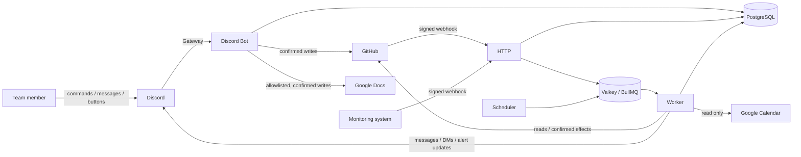
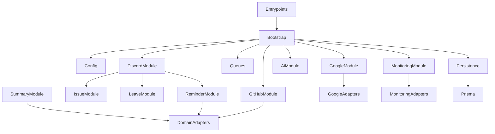
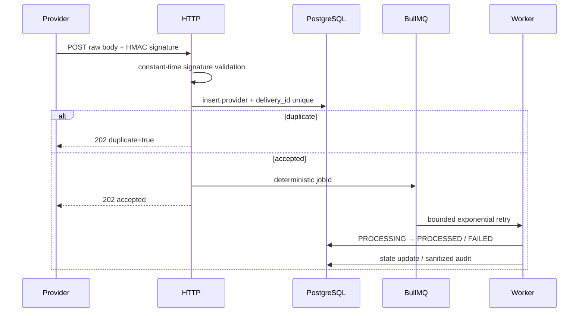
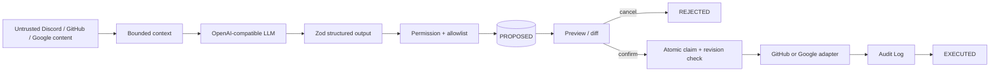
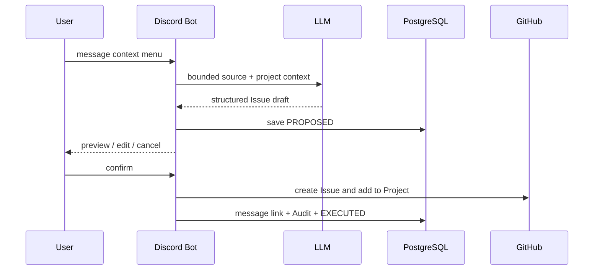

# Architecture

## 核心決策

系統採 TypeScript + Fastify + discord.js + Prisma/PostgreSQL + BullMQ/Valkey 的模組化單體。Discord 是操作介面，GitHub 是正式工作項目來源，PostgreSQL 不複製完整任務管理模型。Google Workspace 與 Monitoring 是可選 adapter。

所有外部呼叫都在 adapter 邊界；domain service 不依賴 Octokit、Discord REST、Google SDK 或 BullMQ 具體型別。HTTP、Bot、Worker、Scheduler 共用模組但有獨立 lifecycle，可分別擴縮與部署。

## System Context



## Module Boundaries



## 資料事實來源

| 資料 | 事實來源 | PostgreSQL 用途 |
| --- | --- | --- |
| Issue、PR、Assignee、Status、Target Date、review、workflow | GitHub | 不建立第二份完整任務表 |
| Discord ↔ GitHub identity | PostgreSQL | `people` |
| Channel ↔ Project／Repository | PostgreSQL | `project_bindings`、`repository_bindings` |
| Google 文件 allowlist | PostgreSQL | `document_bindings` |
| Webhook idempotency | PostgreSQL | `webhook_deliveries` |
| Reminder／snooze／請假 | PostgreSQL | `reminder_states`、`leave_notices` |
| Human confirmation | PostgreSQL | `ai_proposals` |
| Calendar 通知冪等 | PostgreSQL | `calendar_notifications` |
| Monitoring lifecycle | PostgreSQL | `alert_events` |
| 外部與管理寫入 | PostgreSQL | append-only `audit_logs` |

GitHub reconciliation 定期重新讀取遠端資料，不把本地快取升格為事實來源。

## Webhook Flow



GitHub 與 Monitoring 使用不同 secret。Monitoring payload 先通過 Zod schema，再以 `source + fingerprint + environment` 更新同一告警；Critical firing 會建立 Discord thread，resolved 更新原訊息。

## Summary and Reminder Flow

```mermaid
sequenceDiagram
  participant S as Scheduler
  participant W as Worker
  participant G as GitHub
  participant D as PostgreSQL
  participant X as Discord
  participant U as User
  S->>W: summary / reminder job
  W->>G: read Project or repositories
  W->>G: read PR reviews and Actions runs
  W->>W: deterministic risk rules
  W->>D: check identity, leave, snooze
  W->>X: channel summary or DM
  U->>X: 還在進行
  X->>D: create PROPOSED action
  X-->>U: preview; no GitHub write
  U->>X: confirm
  X->>D: atomic claim
  X->>G: idempotent comment + Project status
  X->>D: EXECUTED + Audit Log
```

## AI and Human Confirmation Boundary



純摘要／可行性評估是只讀路徑；輸出明確區分事實、推論與未知。Issue 與 Docs 路徑一定先建立 proposal。GitHub comment 含 proposal marker，Google Docs 使用 required revision ID；大範圍 replace 需要第二次確認。

## Message to Issue Flow



## Google Docs and Calendar

Docs 只能操作與目前 ProjectBinding 關聯的 allowlist 文件。定位順序由 proposal 指定為 Named Range、Heading、marker 或 append；寫入前重讀 revision，避免覆蓋其他人的新修改。`comment` 使用 Drive comment；`insert`／`replace` 使用 Docs batchUpdate。

Calendar adapter 僅讀取共用 Calendar。當日請假與 Calendar 日程由 morning-notification job 執行；每日回報於 16:30 建立 Thread、17:00 彙整；會前提醒每五分鐘掃描一次，`calendar_id + event_id + event_start + notification_type` unique constraint 保證同一活動實例不重複通知。

## Failure and Recovery

外部事件與排程工作走 queue，最多重試後複製至 `dead-letter`。同步人工確認流程使用 atomic proposal claim；失敗標記為 FAILED 並保留錯誤摘要。HTTP、Bot、Worker、Scheduler 均支援 SIGINT／SIGTERM graceful shutdown。Readiness 對 PostgreSQL、Valkey 以及已啟用的 GitHub、Discord、Google Calendar 做有限 timeout 檢查。
